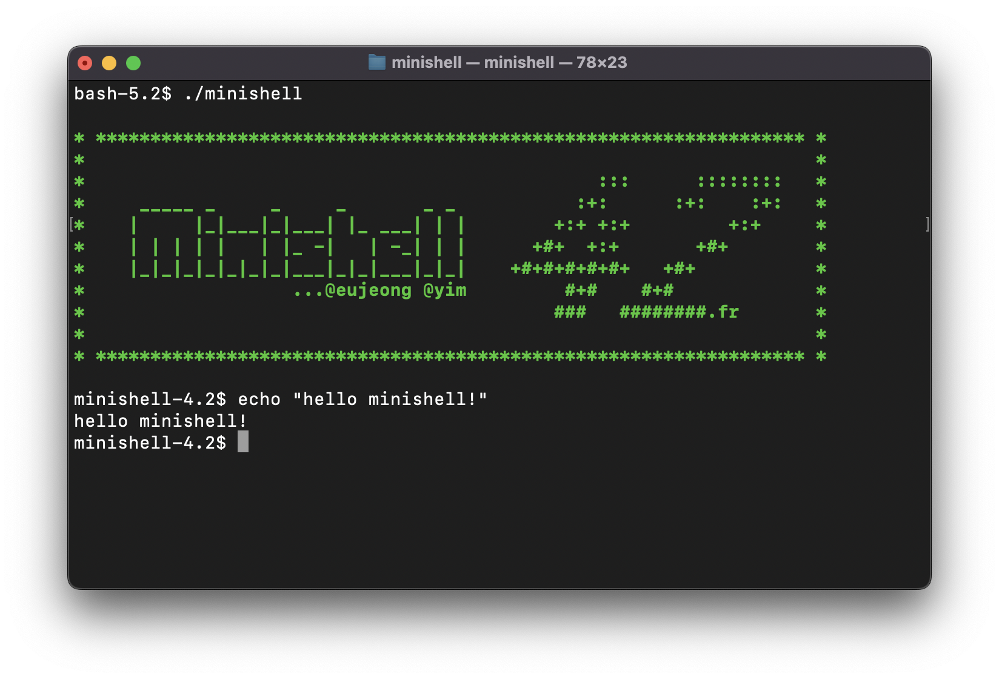
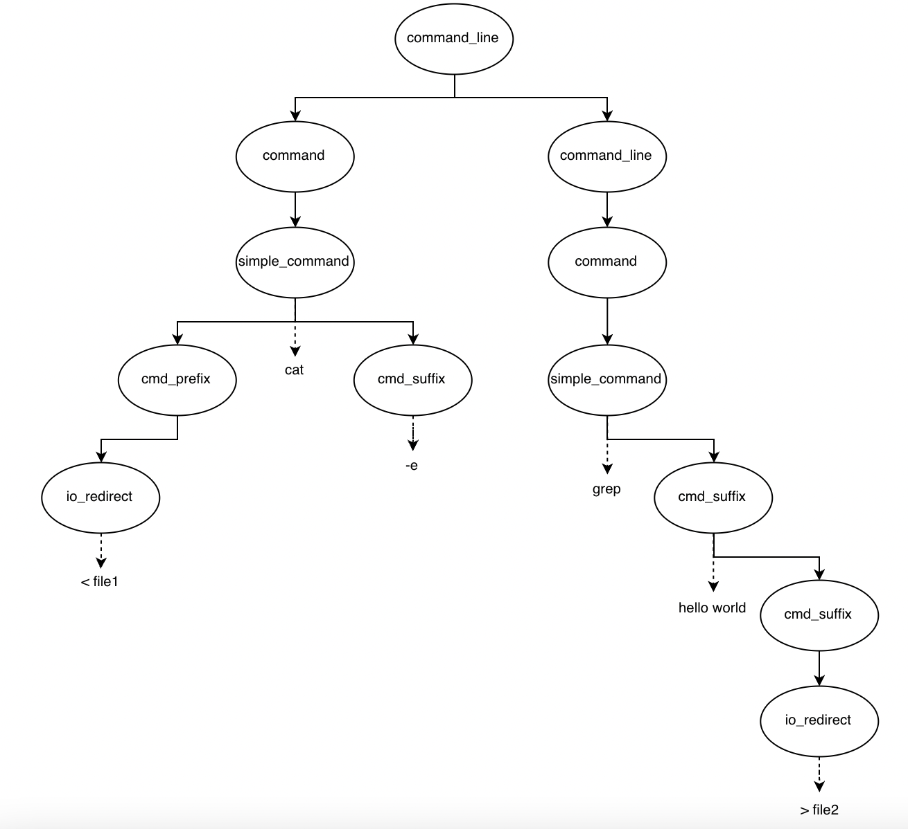
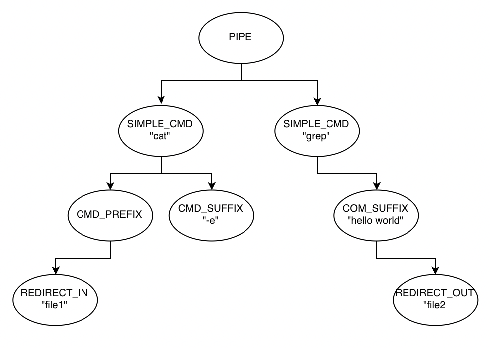

# minishell

bash나 zsh과 같은 간단한 쉘 만들기



## 쉘 동작 (Shell Operation)

다음은 구현한 쉘의 동작에 대한 간략한 설명이다. 실제 bash의 동작방식을 참고하였으며 bash의 동작 방식을 알고싶다면 [[Bash Reference Manual-Shell Operation](https://www.gnu.org/software/bash/manual/bash.html#Shell-Operation)]를 참고하면 된다.

1. 명령어 입력받기 (readline) - 터미널에서 사용자로부터 문자열을 입력받는다.
2. 어휘 분석 (lexcial analysis) - 입력받은 문자열을 토큰 단위로 나눈다.
3. 구문 분석 (syntax analysis) - 토큰들을 받아 구문이 옮바른지 검사하고 구문 트리를 생성한다.
4. 실행 (Execution) - 구문 트리를 순회하며 명령어들을 실행한다.

코드에서는 [main.c]()를 살펴보면 흐름을 간략하게 알 수 있다.
```c
int	main(int argc, char *argv[], char *envp[])
{
	t_lexer		lexer;
	t_astnode	*astree;
	char		*line;
	char		**d_envp;

	shell_init(argc, argv, envp, &d_envp);
	while (1)
	{
		line = readline(PROMPT); // 명령어 입력
		if (line == NULL)
			sh_exit(0);
		if (ft_strlen(line) == 0)
		{
			free(line);
			continue ;
		}
		add_history(line);

		lexer_build(line, ft_strlen(line), &lexer, d_envp); // 어휘 분석
		free(line);

		if (parse(&lexer, &astree)) // 구문 분석
			execute(astree, d_envp); // 실행

		astnode_delete(astree);
		lexer_clear(&lexer);
	}
	free_double_array(d_envp);
}
```

## 어휘 분석 (Lexical Analysis)

어휘 분석(Lexical Analysis) 단계에서는 단순히 터미널에 들어온 사용자 입력을 토큰(token) 단위로 나누는 과정이다.

- token : 쉘에서 입력을 처리하기 위해 적절한 단위로 명령문을 나누어야 하는데 이때 명령문을 나누는 최소 단위   
ex) echo "hello world" > file1   
-> token : ```echo```, ```hello world```, ```>```, ```file1``` 

쉘 확장(ex. 환경변수 확장)또한 여기서 이루어진다. 확장된 토큰은 명령어 및 인자로 분활될 수 있다.
> 원래 bash에서는 구문 분석까지 수행한 후 쉘 확장을 한다.

ex)
```
minishell-4.2$ export a="hello        world"
minishell-4.2$ echo $a
hello world
minishell-4.2$ echo "$a"
hello        world
```
```echo``` ```$a``` -> ```echo``` ```hello        world``` -> ```echo``` ```hello``` ```world```   
```echo``` ```"$a"``` -> ```echo``` ```"hello        world"```

## 구문 분석 (Syntax Analysis)

어휘 분석에서 생성된 토큰들을 받아 주어진 문법에 맞는지를 검사하고, 문법에 맞으면 구문 트리를 생성하는 과정이다.

구문 분석방법에는 여러가지가 있겠지만 여기에선 재귀적 하향식 구문 분석 방식을 사용하였다.

### Syntax 규칙 정의

구문 분석하기 위해서는 문법 정의를 할 필요가 있다.   
[Shell Grammar Rules](https://pubs.opengroup.org/onlinepubs/009604499/utilities/xcu_chap02.html#tag_02_10_02)를 참고해 필요한 부분만 가져와 아래와 같이 정의하였다.

```
<command_line>		::=	<command> '|' <command_line>
 			|	<command>
 
<command>		::=	<simple_command>

<simple_command>	::=	<cmd_prefix> <cmd_word> <cmd_suffix>
			|	<cmd_prefix> <cmd_word>
			|	<cmd_prefix>
			|	<cmd_name> <cmd_suffix>
			|	<cmd_name>
 
<cmd_name>		::=	WORD

<cmd_word>		::=	WORD

<cmd_prefix>		::=	<io_redirect> <cmd_prefix>
			|	<io_redirect>

<cmd_suffix>		::=	<io_redirect> <cmd_suffix>
			|	<io_redirect>
			|	WORD <cmd_suffix>
			|	WORD

<io_redirect>		::=	'>' <filename>
			|	'<' <filename>
			|	'>>' <filename>
			|	'<<' <here_end>

<filename>		::=	WORD

<here_end>		::=	WORD
```

### 구문 트리 Parse Tree

구문 분석으로 통해 생성된 구문 트리는 단순 이진 트리 구조이며, 아래와 같이 정의되어 있다.

```c
typedef struct s_astnode
{
    int			type;
    char		*data;
    struct s_astnode*	left;
    struct s_astnode*	right;

}	t_astnode;
```

### 구문 분석 예 

```< file1 cat -e | grep "hello world" > file2```

위 명령어를 입력하면 아래 그림과 같이 재귀적으로 하강 파싱을 한다.   
구문에 문제가 있을 시 ```Syntax Error```를 발생시키고 문제가 없을 시에는 구문 트리를 생성하게 된다.

<div align="center">
  
</div>

아래 그림은 구문에 문제가 없을 시 생성되는 실제 트리의 형태이다.

<div align="center">
  
</div>

## 실행 (Execution)

구문 트리까지 생성되었다면 실행 파트에선 트리를 순회하며 명령어들을 실행시켜주면 된다.

아래 코드는 단순 트리 순회를 어떻게 하고 있는지를 보여주고 있다. 코드의 복잡성을 없애기 위해 자세한 처리는 생략한 코드이다.

아래와 같이 순회하며 각 노드 위치에서 어떠한 처리를 해주면 되는지를 넣으면 된다.

```c
void	execute(t_astnode *astree, char *envp[])
{
	t_command	cmd;

	command_init(&cmd, envp);
	execute_cmdline(astree, &cmd, envp);
	// ...
}

void	execute_cmdline(t_astnode *astree, t_command *cmd, char *envp[])
{
	if (astree == NULL)
		return ;
	// ...
	if (astree->type == NODE_PIPE)
	{
		// ...
		execute_command(astree->left, cmd, envp);
		execute_cmdline(astree->right, cmd, envp);
	}
	else
	{
		// ...
		execute_command(astree, cmd, envp);
	}
}

void	execute_command(t_astnode *astree, t_command *cmd, char *envp[])
{
	if (astree == NULL)
		return ;
	// ...
	execute_simplecmd(astree, cmd, envp);
	execve_command(cmd, envp);
	// ...
}

void	execute_simplecmd(t_astnode *astree, t_command *cmd, char *envp[])
{
	if (astree == NULL)
		return ;
	// ...
	execute_cmdprefix(astree->left, cmd, envp);
	execute_cmdsuffix(astree->right, cmd, envp);
	// ...
}

void	execute_cmdprefix(t_astnode *astree, t_command *cmd, char *envp[])
{
	if (astree == NULL)
		return ;
	// ...
	execute_ioredirect(astree->left, cmd);
	execute_cmdprefix(astree->right, cmd, envp);
	// ...
}

void	execute_cmdsuffix(t_astnode *astree, t_command *cmd, char *envp[])
{
	if (astree == NULL)
		return ;
	// ...
	execute_ioredirect(astree->left, cmd);
	execute_cmdsuffix(astree->right, cmd, envp);
	// ...
}

void	execute_ioredirect(t_astnode *astree, t_command *cmd)
{
	if (astree == NULL)
		return ;
	// ...
	if (astree->type == NODE_REDIRECT_OUT)
		// ...
	else if (astree->type == NODE_DREDIRECT_OUT)
		// ...
	else if (astree->type == NODE_REDIRECT_IN)
		// ...
	else if (astree->type == NODE_DREDIRECT_IN)
		// ...
	// ...
}
```

## 참고자료

- Bash 레퍼런스 메뉴얼   
https://www.gnu.org/software/bash/manual/bash.html
- 재귀 하상 파싱   
https://github.com/Swoorup/mysh
- Shell 문법 규칙   
https://pubs.opengroup.org/onlinepubs/009604499/utilities/xcu_chap02.html#tag_02_10_02
- readline 설치 및 사용   
https://velog.io/@sham/minishell%EA%B3%BC-readline#%ED%81%B4%EB%9F%AC%EC%8A%A4%ED%84%B0-%EB%A7%A5-%EA%B8%B0%EC%A4%80-readline-%EC%84%A4%EC%B9%98-%EB%B0%8F-%EC%82%AC%EC%9A%A9
